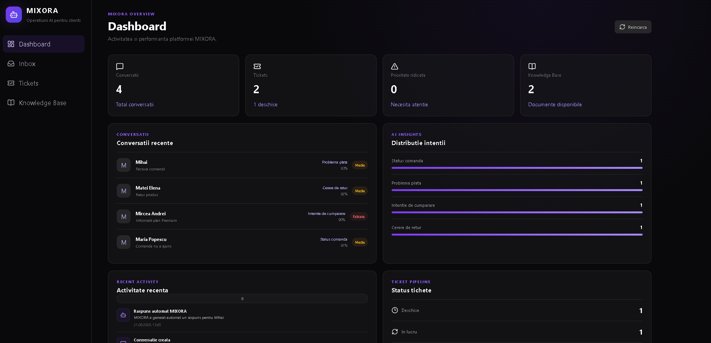
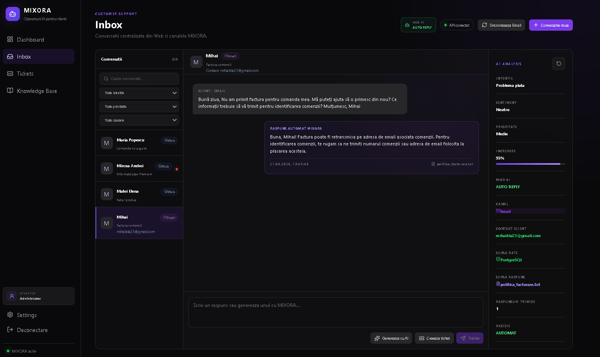
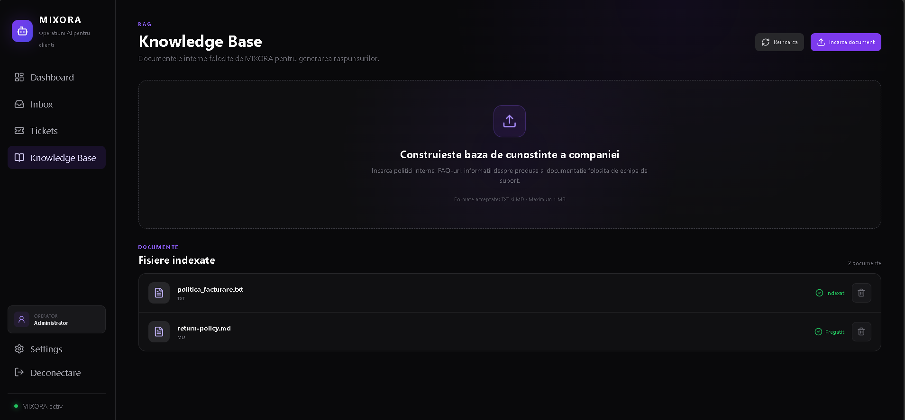

# ⚡ MIXORA

### Local-first AI Customer Operations Platform

MIXORA is an AI-powered customer operations platform that combines **customer conversations, AI-assisted responses, RAG, email integration, ticket management, and operational monitoring** in one workspace.

> 🟢 **Active Development**

---

## ✨ Key Features

- 💬 Unified customer Inbox
- 🧠 Intent, sentiment, priority & confidence analysis
- ✨ AI-generated replies with Draft and Auto Reply modes
- 📚 RAG-powered Knowledge Base
- 📧 Gmail synchronization
- 🎫 Ticket management
- 📊 Operational dashboard & activity tracking
- 🔐 Operator authentication

---

## 📊 Dashboard

Real-time visibility into conversations, tickets, AI insights, activity, and system health.



---

## 💬 AI-Powered Inbox

Customer conversations are analyzed automatically and enriched with relevant internal knowledge before AI-assisted response generation.



```text
Customer Message → AI Analysis → RAG → Local LLM → Response
```

---

## 📚 Knowledge Base

Internal documents are indexed and retrieved through **Qdrant** to provide relevant context for customer responses.



Supported formats: `TXT` · `Markdown`

---

## 🛠️ Tech Stack

**Frontend:** React · TypeScript · Vite  
**Backend:** Python · FastAPI · SQLAlchemy  
**Data:** PostgreSQL · Qdrant  
**AI:** Ollama · Llama 3.2 · RAG  
**Integration:** Gmail API  
**Infrastructure:** Docker · Docker Desktop

---

## 🏗️ Architecture

```text
              Customer
                  │
             Web / Email
                  ▼
        React + TypeScript
                  │
              FastAPI
                  │
        ┌─────────┼─────────┐
        ▼         ▼         ▼
   PostgreSQL   Qdrant    Ollama
        │          │         │
        └──────────┴─────────┘
                   ▼
          AI-Assisted Response
```

---

## 🚀 Local Setup

### Requirements

`Python 3.11+` · `Node.js` · `Docker Desktop` · `Ollama`

### AI

```bash
ollama pull llama3.2:1b
```

### Backend

```bash
cd backend
python -m venv .venv
pip install -r requirements.txt
uvicorn app.main:app --reload
```

### Frontend

```bash
cd frontend
npm install
npm run dev
```

Frontend → `http://localhost:5173`  
API → `http://localhost:8000`

> 🔒 Environment variables and credentials are kept outside version control.

---

<p align="center">
  <strong>MIXORA</strong><br>
  Local AI. Grounded knowledge. Smarter customer operations.
</p>